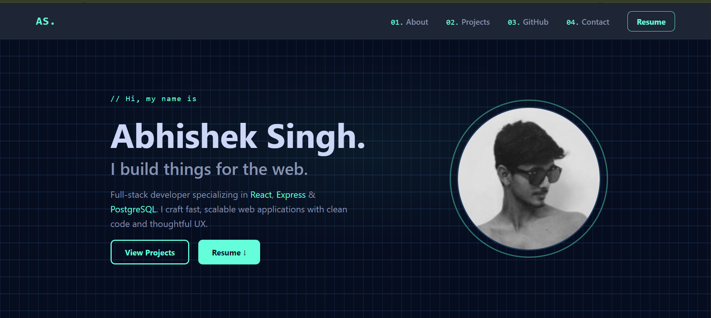
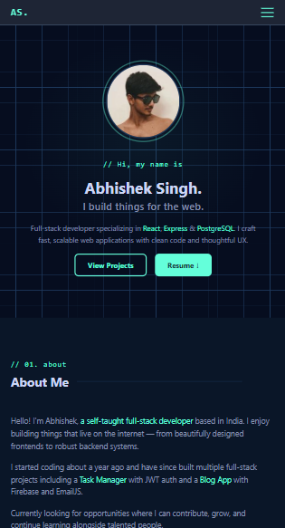

# Abhishek Singh — Personal Portfolio



## 🔗 Live Demo
** https://abhishekportfolio-tbl.vercel.app
---

## ✨ Features

- **Responsive Design** — Fully optimized for mobile, tablet, and desktop
- **Smooth Scroll Navigation** — Single-page layout with anchor-based navigation
- **Dark Theme** — Midnight Teal color palette (inspired by Brittany Chiang)
- **Animated Hero Section** — Grid background with radial glow overlay
- **Tech Stack Showcase** — 25+ technologies with icons and hover effects
- **Live Projects** — Real project cards with demo links and GitHub repos
- **Real GitHub Activity** — Live contribution graph via GitHub Contributions API (no token needed)
- **GitHub Stats** — Real repos, followers, streak stats
- **Contact Form** — EmailJS integration (no backend required)
- **Downloadable Resume** — One-click PDF download

---

## 🛠️ Tech Stack

| Layer | Technology |
|-------|-----------|
| Frontend | React 18, Tailwind CSS |
| Animations | AOS (Animate On Scroll) |
| Contact | EmailJS |
| GitHub Data | GitHub REST API + github-contributions-api |
| Deployment | Vercel |

---

## 📁 Project Structure

```
my-portfolio/
├── public/
│   └── resume.pdf          ← Downloadable resume
├── src/
│   ├── assets/             ← Images, icons, tech logos
│   ├── components/
│   │   ├── Navbar.jsx
│   │   ├── Hero.jsx
│   │   ├── About.jsx
│   │   ├── Projects.jsx
│   │   ├── Github.jsx
│   │   ├── Contact.jsx
│   │   └── Footer.jsx
│   ├── utils/
│   │   ├── techStack.js    ← Tech icons data
│   │   ├── projects.js     ← Projects data
│   │   └── stats.js        ← About stats data
│   ├── App.jsx
│   └── index.css
└── package.json
```

---

## 🚀 Run Locally

### Prerequisites
- Node.js 18+
- npm or yarn

### Setup

```bash
# 1. Clone the repo
git clone https://github.com/Abhisheksingh10734/my-portfolio.git

# 2. Go into the project
cd portfolio

# 3. Install dependencies
npm install

# 4. Create .env file
cp .env.example .env
# Fill in your EmailJS credentials (see below)

# 5. Start dev server
npm start
```

App will run at `http://localhost:3000`

---

## 📧 EmailJS Setup

This portfolio uses [EmailJS](https://emailjs.com) for the contact form — no backend required.

1. Create a free account at [emailjs.com](https://emailjs.com)
2. Add an Email Service (Gmail recommended) → copy **Service ID**
3. Create an Email Template → copy **Template ID**
4. Go to Account → General → copy **Public Key**
5. Add to your `.env` file:

```env
VITE_EMAILJS_SERVICE_ID=service_xxxxxxx
VITE_EMAILJS_TEMPLATE_ID=template_xxxxxxx
VITE_EMAILJS_PUBLIC_KEY=xxxxxxxxxxxx
```

**Template variables used:**
- `{{from_name}}` — sender's name
- `{{from_email}}` — sender's email (also used for Reply-To)
- `{{message}}` — message body

---

## ☁️ Deploy on Vercel

```bash
# Install Vercel CLI
npm install -g vercel

# Deploy
vercel

# Follow prompts — it auto-detects Create React App
```

Or connect your GitHub repo directly on [vercel.com](https://vercel.com) for automatic deploys on every push.

**Add environment variables** in Vercel Dashboard → Project Settings → Environment Variables.

---

## 🎨 Color Palette

| Role | Color | Hex |
|------|-------|-----|
| Page Background |  | `#060D1F` |
| Section Background |  | `#0A1628` |
| Card Background |  | `#112240` |
| Accent (Teal) |  | `#64FFDA` |
| Primary Text |  | `#CCD6F6` |
| Secondary Text |  | `#8892B0` |
| Border |  | `#1E3A5F` |

---

## 📸 Screenshots

| Desktop | Mobile |
|---------|--------|
|  |  |

---

## 📄 License

This project is open source and available under the [MIT License](./LICENSE).

---

## 🙏 Acknowledgements

- Color palette inspired by [Brittany Chiang](https://brittanychiang.com)
- GitHub contribution data by [github-contributions-api](https://github.com/grubersjoe/github-contributions-api)
- GitHub stats cards by [github-readme-stats](https://github.com/anuraghazra/github-readme-stats)
- Tech icons from [devicons](https://devicons.github.io)

---

<p align="center">Designed & Built by <strong>Abhishek Singh</strong> · Made with ❤️ & lots of coffee</p>